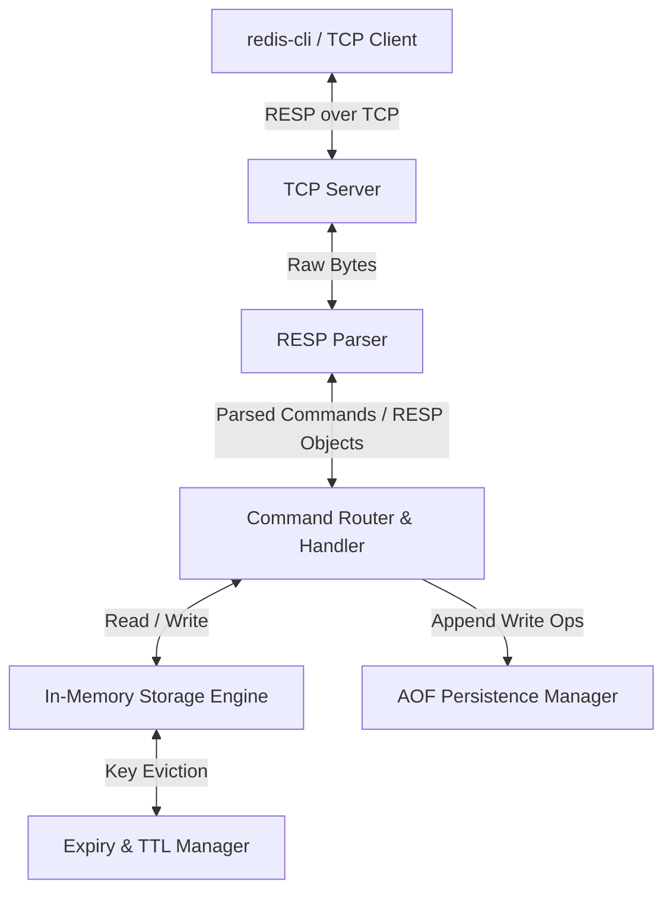

# Project Roadmap & Context: Redis Clone (C++)

This file tracks the design decisions, architecture, milestones, and progress of the Redis Clone (Gedis) project implemented in C++. It serves as a persistent context provider for the AI agent and the user.

---

## 🎯 Project Overview
The goal of this project is to build a fully functional, concurrent, in-memory key-value store modeled after Redis using C++17. We will implement a custom TCP server, parse the Redis Serialization Protocol (RESP), and support key features like expiration, complex data structures, and simple persistence.

### Technical Goals (C++)
- **High Concurrency**: Support multiple concurrent client connections.
- **Protocol Compliance**: Implement RESP specs correctly so standard tools like `redis-cli` work seamlessly.
- **Robust In-Memory Engine**: Efficient thread-safe key-value store using standard C++ maps and synchronization primitives (`std::shared_mutex` or `std::mutex`).
- **Clean Architecture**: Decouple the networking, protocol parsing, and storage engine layers.

---

## 🏗️ Proposed Architecture

---

## 🚦 Current Status & Progress

- **Current Milestone**: `Milestone 4: Core In-Memory KV (GET, SET, DEL)`
- **Overall Progress**: 35% Complete

### Milestone Progress Tracker
- [x] **Milestone 1: Setup & Architecture Selection** (C++ chosen)
- [x] **Milestone 2: TCP Server & Basic Connection Loop**
- [x] **Milestone 3: RESP Parser Implementation**
- [ ] **Milestone 4: Core In-Memory KV (GET, SET, DEL)**
- [ ] **Milestone 5: Expiration & TTL (EX, PX, TTL, PTTL)**
- [ ] **Milestone 6: Additional Data Structures (Hashes, Lists)**
- [ ] **Milestone 7: Persistence (AOF / Append-Only File)**
- [ ] **Milestone 8: Final Optimization & Benchmarks**

---

## 📋 Detailed Milestones & Execution Plan

### Milestone 1: Setup & Architecture Selection (Complete)
- [x] Create project structure, [README.md](file:///Users/lakshyadhawan/Documents/projects/Redis_clone/README.md), and [ROADMAP.md](file:///Users/lakshyadhawan/Documents/projects/Redis_clone/ROADMAP.md).
- [x] Align with the user on C++ as the programming language.
- [ ] Write [Makefile](file:///Users/lakshyadhawan/Documents/projects/Redis_clone/Makefile) and structure the `/src` directory.

### Milestone 2: TCP Server (C++)
- [x] Create a TCP listener on port `6379`.
- [x] Implement client connection handling with concurrent processing.
- [x] Add basic logging for connections/disconnections.

### Milestone 3: RESP Parser (C++)
- [x] Support parsing incoming RESP types.
- [x] Handle partial reads and streaming inputs over TCP sockets.
- [x] Write unit tests for the RESP tokenizer and deserializer.

### Milestone 4: Core In-Memory Key-Value Store
- [ ] Implement thread-safe dictionary/map storage using `std::unordered_map` and standard thread synchronization (`std::shared_mutex` for read-heavy operations).
- [ ] Support basic commands: `PING`, `ECHO`, `SET`, `GET`, `DEL`, `EXISTS`.
- [ ] Ensure proper serialization of replies back to clients in RESP format.

### Milestone 5: Expiration & TTL (Time-To-Live)
- [ ] Extend the `SET` command to support optional arguments `EX` (seconds) and `PX` (milliseconds).
- [ ] Add passive eviction: check expiration on key access.
- [ ] Add active eviction: periodic background cleanup thread for expired keys.
- [ ] Implement `TTL` and `PTTL` commands.

### Milestone 6: Complex Data Structures
- [ ] **Hashes**: `HSET`, `HGET`, `HDEL`, `HGETALL`.
- [ ] **Lists**: `LPUSH`, `RPUSH`, `LPOP`, `RPOP`, `LRANGE`.
- [ ] **Sets**: `SADD`, `SREM`, `SMEMBERS`.

### Milestone 7: Persistence (Append-Only File - AOF)
- [ ] Implement command serialization to an AOF file for all write commands.
- [ ] Implement parsing AOF file on startup to rebuild the in-memory state.
- [ ] Support simple background rewriting of AOF if needed.

---

## 🛠️ Instruction Logs & Context notes for Antigravity Agent

> [!IMPORTANT]
> **CRITICAL CODE REVIEW & CLEANUP PROTOCOL:**
> Before finalizing or completing any milestone, the agent **MUST** perform a dedicated review step:
> 1. **Code Review**: Re-read all written code to check for performance bottlenecks, raw socket edge cases (like partial writes, closed connections, or signal interruption), and race conditions.
> 2. **Dead Code Elimination**: Check for unused imports/headers, redundant temporary variables, unnecessary debug prints, or dead/unreachable branches, and remove them.
> 3. **Simplicity Over Complexity**: Prefer clean, readable code. Do not over-engineer. Use standard, descriptive naming conventions.

> [!TIP]
> **LIBRARY RECOMMENDATION:**
> To make the networking code simpler, cleaner, and easier to understand, consider using **`asio` (standalone header-only version)** or standard C++ socket utilities instead of verbose raw POSIX sockets:
> - **Asio** simplifies event-driven programming, avoids complex manual `select`/`poll` code, handles cross-platform differences, and dramatically reduces boilerplate socket code.
> - If `asio` is used, document the setup/installation in `README.md` and standard build instructions.
